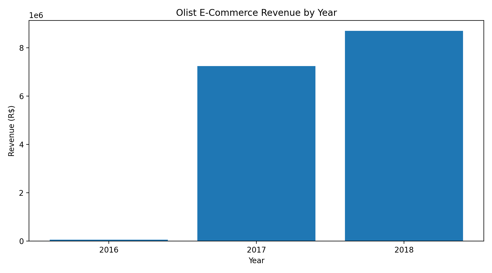
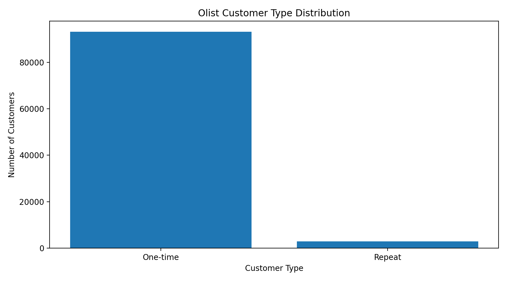
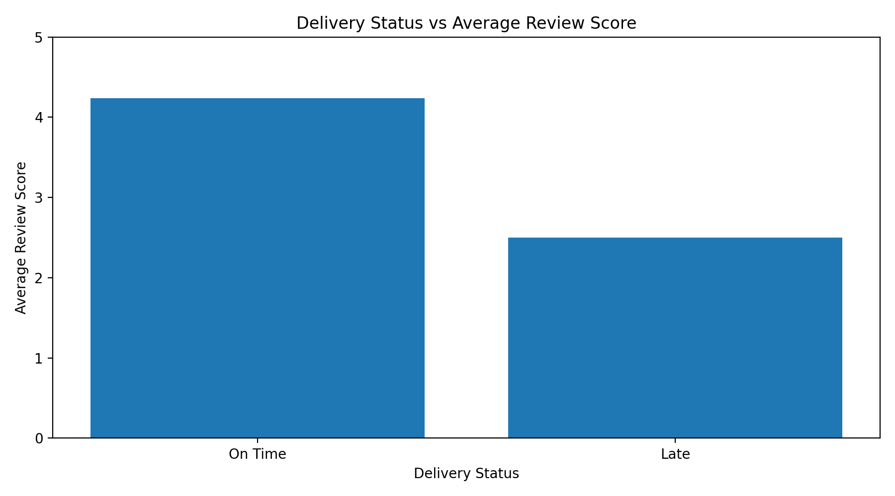

# 🛒 Olist E-commerce SQL Analysis

## 📌 Project Overview

This project analyzes the Olist Brazilian e-commerce dataset using MySQL to uncover insights into sales performance, customer behavior, product performance, geographic trends, delivery operations, seller performance, and customer satisfaction.

The analysis demonstrates practical SQL skills including data exploration, aggregation, joins, Common Table Expressions (CTEs), date functions, conditional logic, and business-focused analysis.

---

## 🎯 Business Objectives

The analysis aims to answer key business questions:

- How has revenue changed over time?
- Which product categories generate the most revenue?
- Which products sell the most?
- Which states generate the most orders and revenue?
- How do customer purchasing patterns differ?
- What percentage of orders are delivered late?
- Which sellers generate the most revenue?
- Does delivery performance affect customer satisfaction?

---

## 🗄️ Dataset

The project uses the **Brazilian E-Commerce Public Dataset by Olist**.

The dataset contains information about:

- Customers
- Orders
- Order items
- Products
- Sellers
- Payments
- Reviews
- Product categories
- Customer locations

The analysis covers orders placed between **September 2016 and October 2018**.

---

## 🛠️ Tools & Technologies

- **MySQL**
- SQL
- MySQL Workbench
- GitHub

### SQL techniques used

- `SELECT`
- `WHERE`
- `GROUP BY`
- `ORDER BY`
- `HAVING`
- `JOIN`
- `CASE`
- Aggregate functions
- Common Table Expressions (CTEs)
- Date functions
- `COUNT`
- `SUM`
- `AVG`
- `ROUND`
- `DATEDIFF`
- `DATE_FORMAT`

---

# 📊 Key Performance Indicators

| KPI | Result |
|---|---:|
| Total Orders | 99,441 |
| Delivered Orders | 96,477 |
| Unique Customers | 93,357 |
| Delivered-Order Revenue | 15,422,461.77 |
| Average Order Value | 159.86 |
| Average Delivery Time | 12.50 days |
| Late Delivery Rate | 8.11% |

> **Note:** Revenue and AOV in the KPI table are based on delivered orders. Other analyses may use the full order dataset depending on the business question.

---

# 🔎 Key Findings

## 💰 Sales Performance

Revenue increased significantly between 2017 and 2018.

| Year | Revenue |
|---|---:|
| 2016 | 59,362.34 |
| 2017 | 7,249,746.73 |
| 2018 | 8,699,763.05 |

The monthly analysis shows strong growth throughout 2017 and 2018, with November 2017 being a particularly strong month.

---

## 👥 Customer Analysis

The customer analysis shows that the majority of customers made only one purchase.

### Customer frequency

- One-time customers: **93,099**
- Customers with 2 orders: **2,745**
- Customers with 3 orders: **203**
- Customers with 4 orders: **30**

There were **2,997 repeat customers** in the analysis.

### Customer spending

| Customer Type | Customers | Average Spend | Total Revenue |
|---|---:|---:|---:|
| One-time | 93,098 | 161.82 | 15,064,849.41 |
| Repeat | 2,997 | 314.99 | 944,022.71 |

Repeat customers had an average spend of approximately **315**, almost twice the average spend of one-time customers.

### Business Insight

Customer retention represents an important growth opportunity. Increasing repeat purchases could potentially increase customer lifetime value and revenue.

---

# 📦 Product Analysis

Several product categories performed strongly across sales and revenue.

### Top categories by allocated revenue

| Category | Allocated Revenue |
|---|---:|
| beleza_saude | 258,385.79 |
| relogios_presentes | 217,319.41 |
| cama_mesa_banho | 214,332.92 |
| esporte_lazer | 202,319.88 |
| informatica_acessorios | 192,796.58 |

The `beleza_saude` category generated the highest allocated revenue in the analysis.

### Top-selling products

The product analysis also identified products with high sales volumes and products generating high revenue, allowing the business to distinguish between:

- High-volume products
- High-value products
- High-priced products

---

# 🌎 Geographic Analysis

São Paulo (`SP`) was the dominant market.

### Orders by state

| State | Orders |
|---|---:|
| SP | 5,180 |
| RJ | 1,652 |
| MG | 1,387 |
| RS | 655 |
| PR | 616 |

São Paulo generated approximately **762,042.63** in revenue and had the largest number of orders.

Interestingly, some states with fewer orders recorded substantially higher average order values.

### Business Insight

The large concentration of orders and revenue in São Paulo suggests that it is a critical market for Olist. However, smaller markets with higher AOVs may also represent opportunities for targeted growth strategies.

---

# 🚚 Delivery Analysis

The overall average delivery time was approximately:

**12.50 days**

### Delivery performance

| Delivery Status | Orders |
|---|---:|
| On Time | 88,652 |
| Late | 7,826 |

The late-delivery rate was approximately:

**8.11%**

### Geographic differences

Delivery performance varied considerably by state.

Some states experienced average delivery times above 20 days, while São Paulo averaged approximately 8.73 days.

### Business Insight

Delivery performance varies significantly by geography, suggesting that logistics infrastructure, distance, and regional fulfillment capabilities may influence customer experience.

---

# 🏪 Seller Analysis

The seller analysis examined:

- Revenue
- Orders
- Items sold
- Average delivery time

### Top sellers by revenue

The highest-performing seller generated approximately **47,594.72** in product revenue.

Other high-performing sellers generated between approximately **25,000 and 37,000** in revenue.

The analysis also revealed differences in seller delivery performance.

### Business Insight

Seller performance should not be evaluated using revenue alone. High-revenue sellers should also be monitored for delivery performance because operational issues can affect customer satisfaction.

---

# ⭐ Customer Satisfaction

Customer reviews were analyzed using review scores from 1 to 5.

### Review score distribution

| Review Score | Reviews |
|---|---:|
| 5 | 164 |
| 4 | 39 |
| 3 | 30 |
| 2 | 8 |
| 1 | 38 |

### Delivery vs Review Score

| Delivery Status | Reviews | Average Review |
|---|---:|---:|
| On Time | 246 | 4.24 |
| Late | 24 | 2.50 |

Late deliveries were associated with substantially lower customer review scores.

The difference between the two groups was **1.74 rating points**.

> This result indicates an association between delivery performance and customer satisfaction; it does not by itself prove that late delivery causes lower ratings.

---

# 💡 Business Recommendations

Based on the analysis, the following actions could improve e-commerce performance:

### 1. Improve customer retention

The large number of one-time customers suggests an opportunity to increase repeat purchases through:

- Personalized promotions
- Product recommendations
- Loyalty programs
- Post-purchase engagement

### 2. Improve delivery performance

The **8.11% late-delivery rate** indicates room for improvement.

The business could investigate:

- Regional logistics performance
- Seller fulfillment times
- Delivery partners
- High-delay geographic areas

### 3. Prioritize high-performing categories

Categories such as `beleza_saude`, `relogios_presentes`, and `cama_mesa_banho` generated substantial revenue and could receive additional marketing attention.

### 4. Monitor seller performance

Seller performance should be evaluated using both revenue and operational metrics such as delivery time.

### 5. Focus on customer experience

Because late orders were associated with significantly lower review scores, improving delivery reliability could contribute to better customer satisfaction.

---

# 📂 Project Structure

```text
olist-ecommerce-sql-analysis/
│
├── README.md
│
└── sql/
    ├── 01_data_exploration.sql
    ├── 02_customer_analysis.sql
    ├── 03_sales_analysis.sql
    ├── 04_product_analysis.sql
    ├── 05_geographic_analysis.sql
    ├── 06_delivery_analysis.sql
    ├── 07_seller_analysis.sql
    └── 08_customer_satisfaction.sql
---

]
---

## 📊 Key Results

| Metric | Result |
|---|---:|
| Total Orders | 96,477 |
| Total Customers | 93,357 |
| Total Revenue | R$15.42M |
| Average Order Value | R$159.86 |
| Average Delivery Time | 12.50 days |
| Late Delivery Rate | 8.11% |
| Delivered Orders | 96,478 |
## 📊 Visual Analysis

### Revenue Growth



### Customer Distribution



### Delivery and Customer Satisfaction



### 💰 Revenue Growth

Revenue increased substantially over the period analyzed:

- **2016:** R$59,362.34
- **2017:** R$7.25M
- **2018:** R$8.70M

**2018 was the strongest full year by revenue.**

### 👥 Customer Insights

- 93,098 customers were classified as one-time customers.
- 2,997 customers were repeat customers.
- Repeat customers spent an average of **R$314.99**, compared with **R$161.82** for one-time customers.
- Customer retention therefore represents an important growth opportunity.

### 🛍️ Product Insights

The highest-revenue product categories included:

1. `beleza_saude` — R$258,385.79
2. `relogios_presentes` — R$217,319.41
3. `cama_mesa_banho` — R$214,332.92
4. `esporte_lazer` — R$202,319.88
5. `informatica_acessorios` — R$192,796.58

### 🚚 Delivery Insights

- **88,652** orders were delivered on time.
- **7,826** orders were delivered late.
- Late deliveries represented approximately **8.11%** of delivered orders.
- On-time deliveries had an average review score of **4.24**.
- Late deliveries had an average review score of **2.50**.

This indicates that delivery performance is closely associated with customer satisfaction.

### 💡 Business Recommendations

- Increase repeat purchases through customer retention strategies.
- Improve logistics to reduce late deliveries.
- Monitor seller performance using revenue, order volume, delivery time, and reviews.
- Focus marketing efforts on high-performing product categories.
- Investigate causes of late deliveries and their impact on customer satisfaction.

---

## 📁 Project Structure

```text
olist-ecommerce-sql-analysis/
│
├── sql/
│   ├── 01_data_exploration.sql
│   ├── 02_customer_analysis.sql
│   ├── 03_revenue_analysis.sql
│   ├── 04_product_analysis.sql
│   ├── 05_geographic_analysis.sql
│   ├── 06_delivery_analysis.sql
│   ├── 07_seller_analysis.sql
│   ├── 08_customer_satisfaction.sql
│   │
│   └── results/
│       ├── .gitignore
│       └── key_findings.md
│
└── README.md
